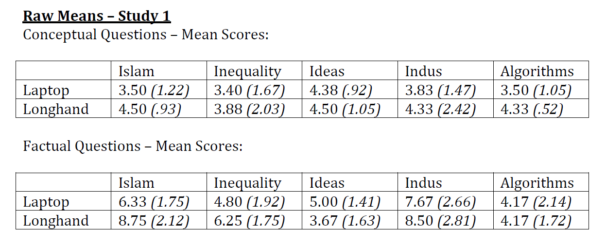

  
# Report Details

```{r}
articleID <- "CARPS_1-6-2014_PS" # insert the article ID code here e.g., "10-3-2015_PS"
reportType <- "final" # specify whether this is the 'pilot' report or 'final' report
pilotNames <- "Tysen Dauer, Erik Santoro, Jaclyn Schwartz" # insert the pilot's name here e.g., "Tom Hardwicke".  If there are multiple cpilots enter both names in a character string e.g., "Tom Hardwicke, Bob Dylan"
copilotNames <- "Michèle Nuijten" # insert the co-pilot's name here e.g., "Michael Frank". If there are multiple co-pilots enter both names in a character string e.g., "Tom Hardwicke, Bob Dylan"
pilotTTC <- 525 # insert the pilot's estimated time to complete (in minutes, fine to approximate) e.g., 120
copilotTTC <- 960 # insert the co-pilot's estimated time to complete (in minutes, fine to approximate) e.g., 120
pilotStartDate <- as.Date("10/26/17", format = "%m/%d/%y") # insert the pilot's start date in US format e.g., as.Date("01/25/18", format = "%m/%d/%y")
copilotStartDate <- as.Date("07/03/18", format = "%m/%d/%y") # insert the co-pilot's start date in US format e.g., as.Date("01/25/18", format = "%m/%d/%y")
completionDate <- as.Date("08/29/18", format = "%m/%d/%y") # copilot insert the date of final report completion (after any necessary rounds of author assistance) in US format e.g., as.Date("01/25/18", format = "%m/%d/%y")
```

-------
  
#### Methods summary: 

Mueller et al. 2014 aimed to find out if note-taking medium (longhand or laptop) had an effect on participants' ability to correctly answer factual and conceptual questions. Study 1 asked 67 participants to watch one of five different lectures, perform distractor tasks, and then answer questions about the lecture they viewed. They found that note-taking medium had a significant effect on Conceptual answers but not on Factual answers.

The authors report converting the raw data to z scores before listing the ANOVA results from 4 tests: 
1. Factual-recall questions by condition (laptop or longhand),
2. Conceptual-application questions by condition,
3. Conceptual-application affected by lecture (labelled "whichtalk" in the data), and 
4. Interaction between lecture and note-taking medium (labelled "condition" in the data).
According to the article, all of these ANOVAs were mixed fixed- and random-effects ANOVAs, with note-taking medium (laptop vs. longhand) as a fixed effect and lecture (which talk was viewed) as a random effect.

Before reproducing the ANOVAs, I reproduced the means and standard deviations reported for the raw and z scored data. 

------

#### Target outcomes: 

For this article you should focus on the findings reported for Study 1 in section "Laptop versus longhand performance".

Specifically, you should attempt to reproduce all descriptive and inferential analyses reported in the text below and associated tables/figures:

> Laptop versus longhand performance. Mixed fixed and random-effects analyses of variance were used to test differences, with note-taking medium (laptop vs.longhand) as a fixed effect and lecture (which talk was viewed) as a random effect. We converted the raw data to z scores because the lecture assessments varied in difficulty and number of points available; however, results did not differ when raw scores were analyzed.4 On factual-recall questions, participants performed equally well across conditions (laptop: M = 0.021, SD = 1.31; longhand: M = 0.009, SD = 1.02), F(1, 55) = 0.014, p = .91. However, on conceptual-application questions, laptop participants performed significantly worse (M = −0.156, SD = 0.915) than longhand participants (M = 0.154, SD = 1.08), F(1, 55) = 9.99, p = .03, ηp2 = .13 (see Fig. 1).5 Which lecture participants saw also affected performance on conceptual-application questions, F(4, 55) = 12.52, p = .02, ηp2 = .16; however, there was no significant interaction between lecture and note-taking medium, F(4, 55) = 0.164, p = .96. (from Mueller & Oppenheimer, 2014, p. 1161)

------

```{r global_options, include=FALSE}
knitr::opts_chunk$set(echo=TRUE, warning=FALSE, message=FALSE)
```

## Step 1: Load packages

```{r}
library(tidyverse) # for data munging
library(knitr) # for kable table formating
library(haven) # import and export 'SPSS', 'Stata' and 'SAS' Files
library(CARPSreports) # custom report functions

# Libraries needed for ANOVA tests.
library(car)
library(lme4)
library(Matrix)
library(lmerTest)
library(lsr)
```

```{r}
# Prepare report object. This will be updated automatically by the reproCheck function each time values are compared
reportObject <- data.frame(dummyRow = TRUE, reportedValue = NA, obtainedValue = NA, valueType = NA, percentageError = NA, comparisonOutcome = NA, eyeballCheck = NA)
```

## Step 2: Load data

```{r}
data <- read_spss("data/Study_1_Upload_Data.sav")
```

## Step 3: Tidy data

```{r}
# make data tidier by gathering the variable of interest in long format
data_tidy <- data %>%
  select(condition, objectiveZ, openZ) %>%
  gather("item_type_Z", "Z_score", objectiveZ, openZ)
```

## Step 4: Run analysis

### Pre-processing

A note about nomenclature: in the paper the authors refer to Factual and Conceptual questions. In the data these items are labelled "objective" and "open", respectively. 

### Descriptive statistics

From the article (emphasis added):

> On factual-recall questions, participants performed equally well
across conditions (laptop: **M = 0.021, SD = 1.31**; longhand: **M = 0.009, SD = 1.02**), [...] However, on conceptual-application questions, laptop participants performed significantly worse (**M = −0.156, SD = 0.915**) than longhand participants (**M = 0.154, SD = 1.08**). (from Mueller & Oppenheimer, 2014, p. 1161)

```{r}
descriptives <- data_tidy %>%
  group_by(item_type_Z, condition) %>%
  summarize(mean = mean(Z_score),
            sd = sd(Z_score)) %>%
  gather("statistic", "value", mean, sd)
  
descriptives$reportedValue <-  c(0.021, 0.009, -0.156, 0.154,
                                 1.31, 1.02, 0.915, 1.08)

```

It seems that the standard deviation of the objective questions is off. I get 0.9965552 and they report 1.31. Otherwise these numbers are correct.

```{r}
for(i in 1:nrow(descriptives)){
  reportObject <- reproCheck(
    reportedValue = as.character(descriptives$value[i]),
    obtainedValue = descriptives$reportedValue[i],
    valueType = as.character(descriptives$statistic[i]))
}
```

I also found the reported Raw Means for Study 1 and calculated them for comparison (these raw numbers are reported in the "Supplemental Material" folder, the file is named *Raw_Means_and_Questions.pdf). See also the screenshot of these tables below.

 

```{r}
# tidy the data based on the raw scores
data_tidy_rawscores <- data %>%
  select(condition, whichtalk, rawobjective, rawopen) %>%
  gather("item_type_raw", "raw_score", rawobjective, rawopen)

# calculate means per talk, item type, and condition
raw_means <- data_tidy_rawscores %>%
  group_by(item_type_raw, condition, whichtalk)%>%
  summarize(mean= mean(raw_score), 
            sd = sd(raw_score)) %>%
  gather("statistic", "value", mean, sd)

# copy reported means from supplemental table
raw_means$reportedValue <- c(6.33, 4.80, 5.00, 7.67, 4.17,
                             8.75,6.25, 3.67, 8.50, 4.17,
                             3.50, 3.40, 4.38, 3.83, 3.50,
                             4.50, 3.88, 4.50, 4.33, 4.33,
                             1.75, 1.92, 1.41, 2.66, 2.14,
                             2.12, 1.75, 1.63, 2.81, 1.72,
                             1.22, 1.67, .92, 1.47, 1.05,
                             .93, 2.03, 1.05, 2.42, .52)
```


Here too I found some differences that might help unravel later discrepancies. They seem to have different data for the condition:laptop lectures on Islam and Algorithms. Here is a verbal description. Please find the recorded errors repeated formally below.

In Factual questions, they reported the following [raw scores and (standard deviations)]: 
condition (laptop (=0)), whichtalk (Islam) [6.33 (1.75)] 
where I find [5.83 (2.48)]. 
Also in Factual questions, they reported: 
condition (laptop), whichtalk (Algorithms) [4.17 (2.14)]
where I find [4.67 (1.86)].

The laptop condition lectures on Islam and Algorithms also differed in Conceptual questions:
for Islam they report [3.50 (1.22)]
where I got [3.33 (1.03)]
and for Algorithm they report [3.50 (1.05)]
where I got [3.67 (1.21)].

Maybe they removed some subjects at this stage that make the standard deviation off and throw the later ANOVAs?

There is mention in the "Study 1 Participants" section of the paper of removing two participants. Those excluded participants seem not to be included in their public data (they report 67 participants minus the 2 = 65 participants, the number in their public data). I found no other mention of excluded data or differently aggregated data in the paper or supplemental materials.

Note that the discrepancies in these supplemental descriptives are now also included in the final count, even they are not directly the target outcomes.

```{r}
for(i in 1:nrow(raw_means)){
  reportObject <- reproCheck(
    reportedValue = as.character(raw_means$value[i]),
    obtainedValue = raw_means$reportedValue[i],
    valueType = as.character(raw_means$statistic[i]))
}
```

### Inferential statistics

```{r}
# Make sure that whichtalk is read as a factor variable
data$whichtalk <- as.factor(data$whichtalk)
```

#### 1. Factual-recall questions by condition (laptop or longhand)

The first inferential test is the following (from the article):

> On factual-recall questions, participants performed equally well across conditions (laptop: M = 0.021, SD = 1.31; longhand: M = 0.009, SD = 1.02), F(1, 55) = 0.014, p = .91.

In the paper, the authors fit an ANOVA with a fixed and a random effect and obtained the following result: F(1,55) = 0.014, p = .91. 

I tried to fit the same model, using the `lmer()` function. The obtained p-value (p = .952) is close to the reported one (p = .91), but the F-value is much lower (F = .0037 vs. F = .014), and using `lmer()` leads to completely different degrees of freedom.

```{r}
# attempt to fit lmer model
model <- lmer(objectiveZ ~ condition + (1|whichtalk),
             data = data)
result1 <- anova(model)

result1
```


```{r}
# Check values for ANOVA
 reportObject <- reproCheck(
    reportedValue = "1",
    obtainedValue = result1$NumDF,
    valueType = "df")

reportObject <- reproCheck(
    reportedValue = "55",
    obtainedValue = result1$DenDF,
    valueType = "df")

reportObject <- reproCheck(
    reportedValue = "0.014",
    obtainedValue = result1$`F value`,
    valueType = "F")

reportObject <- reproCheck(
    reportedValue = ".91",
    obtainedValue = result1$`Pr(>F)`,
    valueType = "p")
```


#### 2. Conceptual-application questions by condition

> However, on conceptual-application questions, laptop participants performed significantly worse (M = −0.156, SD = 0.915) than longhand participants (M = 0.154, SD = 1.08), F(1, 55) = 9.99, p = .03, ηp2 = .13 (see Fig. 1).

```{r}
model <- lmer(openZ ~ condition + (1|whichtalk),
             data = data)
result2 <- anova(model)

result2
```

The reproduced results are different from the reported results. First, the residual degrees of freedom are different. The authors reported integers, whereas the `lmer()` mixed model resulted in degrees of freedom with decimal numbers. This could indicate that the authors used a different model than was used in this reproducibility attempt, which might also explain the differences in the results.

```{r}
# This was an attempt at investigating the eta squared value. I was unable to get the function to work.
# etaSquared(model, type = 2, anova = TRUE)
```

```{r}
# Check values for ANOVA
 reportObject <- reproCheck(
    reportedValue = "1",
    obtainedValue = result2$NumDF,
    valueType = "df")

reportObject <- reproCheck(
    reportedValue = "55",
    obtainedValue = result2$DenDF,
    valueType = "df")

reportObject <- reproCheck(
    reportedValue = "9.99",
    obtainedValue = result2$`F value`,
    valueType = "F")

reportObject <- reproCheck(
    reportedValue = ".03",
    obtainedValue = result2$`Pr(>F)`,
    valueType = "p")
```


#### 3. Conceptual-application affected by lecture

> Which lecture participants saw also affected performance on conceptual-application questions, F(4, 55) = 12.52, p = .02, ηp2 = .16;

```{r}
# Lecture (whichtalk) affects performance on conceptual-application questions (openZ).
aovLecture <- aov(openZ ~ whichtalk, data = data)
result3 <- summary(aovLecture)

result3
```

The reproduced results are different from the reported results. First, the residual degrees of freedom are off. It seems that there were fewer observations in the analysis in the paper. This might explain why this result is different here. The reported result is internally consistent: the reported F value and degrees of freedom are in line with the reported p-value.

```{r}
# Check values for ANOVA
 reportObject <- reproCheck(
    reportedValue = "4",
    obtainedValue = result3[[1]]["whichtalk", "Df"],
    valueType = "df")

reportObject <- reproCheck(
    reportedValue = "55",
    obtainedValue = result3[[1]]["Residuals", "Df"],
    valueType = "df")

reportObject <- reproCheck(
    reportedValue = "12.52",
    obtainedValue = result3[[1]]["whichtalk", "F value"],
    valueType = "F")

reportObject <- reproCheck(
    reportedValue = ".02",
    obtainedValue = result3[[1]]["whichtalk", "Pr(>F)"],
    valueType = "p")
```

#### 4. Interaction between lecture and note-taking medium

> [...] however, there was no significant interaction between lecture and note-taking medium, F(4, 55) = 0.164, p = .96.

```{r}
# Interaction between lecture (whichtalk) and note-taking medium (condition). 
aovLectureCondition <- aov(openZ ~ whichtalk * condition, data = data)
result4 <- summary(aovLectureCondition)

result4
```

Running this ANOVA resulted in the same values as reported in the paper.

```{r}
# Check values for ANOVA
 reportObject <- reproCheck(
    reportedValue = "4",
    obtainedValue = result4[[1]]["whichtalk:condition", "Df"],
    valueType = "df")

reportObject <- reproCheck(
    reportedValue = "55",
    obtainedValue = result4[[1]]["Residuals", "Df"],
    valueType = "df")

reportObject <- reproCheck(
    reportedValue = "0.164",
    obtainedValue = result4[[1]]["whichtalk:condition", "F value"],
    valueType = "F")

reportObject <- reproCheck(
    reportedValue = ".96",
    obtainedValue = result4[[1]]["whichtalk:condition", "Pr(>F)"],
    valueType = "p")
```

## Step 5: Conclusion

The reported ANOVAs were the main findings. We encountered major errors already at the descriptive statistics stage. Hopefully these can be easily resolved by contacting the authors to find out what additional data processing, cleaning, or exclusions might be causing these differences. 

The innaccurate ANOVA findings recorded here (including the difference in reported degrees of freedom) may arise for the following reasons: the underlying data differences just described, incorrect R scripts for the ANOVAs reported in the article, or they may actually be different. The time to complete is possibly unusually long because I had not previously run mixed-effects ANOVAs and needed time and assistance implementing them in R. 

Interestingly, a quick statcheck analysis showed that only one result was inconsistently reported (F(1, 55) = 9.99, p = .03; calcualted p = .003).

```{r}
Author_Assistance = FALSE # was author assistance provided? (if so, enter TRUE)

Insufficient_Information_Errors <- 0 # how many discrete insufficient information issues did you encounter?

# Assess the causal locus (discrete reproducibility issues) of any reproducibility errors. Note that there doesn't necessarily have to be a one-to-one correspondance between discrete reproducibility issues and reproducibility errors. For example, it could be that the original article neglects to mention that a Greenhouse-Geisser correct was applied to ANOVA outcomes. This might result in multiple reproducibility errors, but there is a single causal locus (discrete reproducibility issue).

locus_typo <- 0 # how many discrete issues did you encounter that related to typographical errors?
locus_specification <- 0 # how many discrete issues did you encounter that related to incomplete, incorrect, or unclear specification of the original analyses?
locus_analysis <- 11 # how many discrete issues did you encounter that related to errors in the authors' original analyses?
locus_data <- NA # how many discrete issues did you encounter that related to errors in the data files shared by the authors?
locus_unidentified <- NA # how many discrete issues were there for which you could not identify the cause

# How many of the above issues were resolved through author assistance?
locus_typo_resolved <- NA # how many discrete issues did you encounter that related to typographical errors?
locus_specification_resolved <- NA # how many discrete issues did you encounter that related to incomplete, incorrect, or unclear specification of the original analyses?
locus_analysis_resolved <- NA # how many discrete issues did you encounter that related to errors in the authors' original analyses?
locus_data_resolved <- NA # how many discrete issues did you encounter that related to errors in the data files shared by the authors?
locus_unidentified_resolved <- NA # how many discrete issues were there for which you could not identify the cause

Affects_Conclusion <- 2 # Do any reproducibility issues encounter appear to affect the conclusions made in the original article? TRUE, FALSE, or NA. This is a subjective judgement, but you should taking into account multiple factors, such as the presence/absence of decision errors, the number of target outcomes that could not be reproduced, the type of outcomes that could or could not be reproduced, the difference in magnitude of effect sizes, and the predictions of the specific hypothesis under scrutiny.
```

```{r}
reportObject <- reportObject %>%
  filter(dummyRow == FALSE) %>% # remove the dummy row
  select(-dummyRow) %>% # remove dummy row designation
  mutate(articleID = articleID) %>% # add variables to report 
  select(articleID, everything()) # make articleID first column

# decide on final outcome
if(any(reportObject$comparisonOutcome %in% c("MAJOR_ERROR", "DECISION_ERROR")) | Insufficient_Information_Errors > 0){
  finalOutcome <- "Failure without author assistance"
  if(Author_Assistance == T){
    finalOutcome <- "Failure despite author assistance"
  }
}else{
  finalOutcome <- "Success without author assistance"
  if(Author_Assistance == T){
    finalOutcome <- "Success with author assistance"
  }
}

# collate report extra details
reportExtras <- data.frame(articleID, pilotNames, copilotNames, pilotTTC, copilotTTC, pilotStartDate, copilotStartDate, completionDate, Author_Assistance, finalOutcome, Insufficient_Information_Errors, locus_typo, locus_specification, locus_analysis, locus_data, locus_unidentified, locus_typo_resolved, locus_specification_resolved, locus_analysis_resolved, locus_data_resolved, locus_unidentified_resolved)

# save report objects
if(reportType == "pilot"){
  write_csv(reportObject, "pilotReportDetailed.csv")
  write_csv(reportExtras, "pilotReportExtras.csv")
}

if(reportType == "final"){
  write_csv(reportObject, "finalReportDetailed.csv")
  write_csv(reportExtras, "finalReportExtras.csv")
}
```

# Session information

```{r session_info, include=TRUE, echo=TRUE, results='markup'}
devtools::session_info()
```

