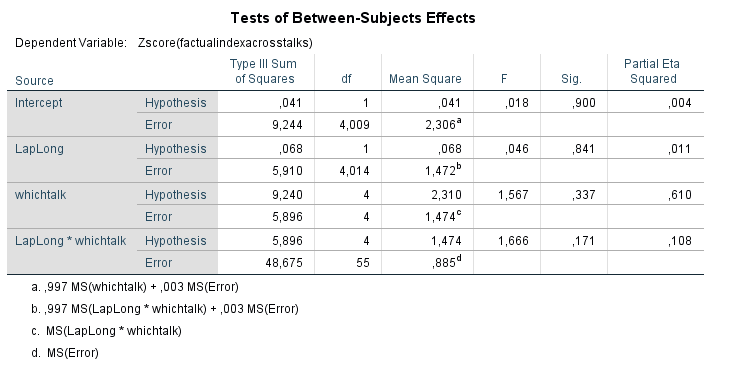
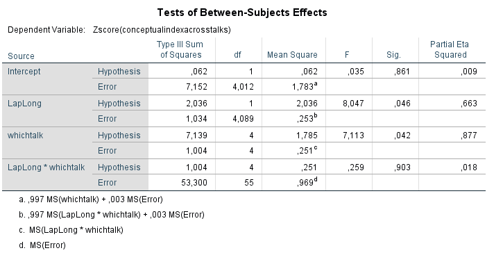

# Report Details

```{r}
articleID <- "CARPS_1-6-2014_PS" # insert the article ID code here e.g., "10-3-2015_PS"
reportType <- "final" # specify whether this is the 'pilot' report or 'final' report
pilotNames <- "Tysen Dauer, Erik Santoro, Jaclyn Schwartz" # insert the pilot's name here e.g., "Tom Hardwicke".  If there are multiple cpilots enter both names in a character string e.g., "Tom Hardwicke, Bob Dylan"
copilotNames <- "Michèle Nuijten" # insert the co-pilot's name here e.g., "Michael Frank". If there are multiple co-pilots enter both names in a character string e.g., "Tom Hardwicke, Bob Dylan"
pilotTTC <- 525 # insert the pilot's estimated time to complete (in minutes, fine to approximate) e.g., 120
copilotTTC <- 1280 # insert the co-pilot's estimated time to complete (in minutes, fine to approximate) e.g., 120
pilotStartDate <- as.Date("10/26/17", format = "%m/%d/%y") # insert the pilot's start date in US format e.g., as.Date("01/25/18", format = "%m/%d/%y")
copilotStartDate <- as.Date("07/03/18", format = "%m/%d/%y") # insert the co-pilot's start date in US format e.g., as.Date("01/25/18", format = "%m/%d/%y")
completionDate <- as.Date("05/02/18", format = "%m/%d/%y") # copilot insert the date of final report completion (after any necessary rounds of author assistance) in US format e.g., as.Date("01/25/18", format = "%m/%d/%y")
```

------

#### Methods summary: 

Mueller et al. 2014 aimed to find out if note-taking medium (longhand or laptop) had an effect on participants' ability to correctly answer factual and conceptual questions. Study 1 asked 67 participants to watch one of five different lectures, perform distractor tasks, and then answer questions about the lecture they viewed. They found that note-taking medium had a significant effect on Conceptual answers but not on Factual answers.

The authors report converting the raw data to z scores before listing the ANOVA results from 4 tests: 
1. Factual-recall questions by condition (laptop or longhand),
2. Conceptual-application questions by condition,
3. Conceptual-application affected by lecture (labelled "whichtalk" in the data), and 
4. Interaction between lecture and note-taking medium (labelled "condition" in the data).
According to the article, all of these ANOVAs were mixed fixed- and random-effects ANOVAs, with note-taking medium (laptop vs. longhand) as a fixed effect and lecture (which talk was viewed) as a random effect.

In 2018, a corrigendum for this paper was published. Here, they explain that they now calculate z-scores for each of the studies using an index-score approach. New data files with corrected z-scores have been uploaded to OSF. These are the data files used in this reproducibility analysis.

In the corrigendum they also list corrected degrees of freedom.

------

#### Target outcomes: 

For this article you should focus on the findings reported for Study 1 in section "Laptop versus longhand performance". You should use the values reported in the the corrigendum, not the main paper.

Specifically, you should attempt to reproduce all descriptive and inferential analyses reported in the text below and associated tables/figures:

> Laptop versus longhand performance. Mixed fixed and random-effects analyses of variance were used to test differences, with note-taking medium (laptop vs.longhand) as a fixed effect and lecture (which talk was viewed) as a random effect. We converted the raw data to z scores because the lecture assessments varied in difficulty and number of points available; however, results did not differ when raw scores were analyzed. (from Mueller & Oppenheimer, 2014, p. 1161) 

> On factual-recall questions, participants performed equally well across conditions (laptop: M = −0.006, SD = 1.00; longhand: M = 0.05, SD = 1.01), F(1,4.01) = 0.046, p = .841. However, on conceptual application questions, laptop participants performed significantly worse (M = −0.178, SD = 0.900) than longhand participants (M = 0.162, SD = 1.07), F(1, 4.09) = 8.05, p = .046, ηp 2 = .66 (see Fig. 1). Which lecture participants saw also affected performance on conceptual-application questions, F(4, 4) = 7.11, p = .042, ηp2 = .88; however, there was no significant interaction between lectureand note-taking medium, F(4, 55) = 0.259, p = .90. (from Mueller & Oppenheimer, corrigendum, 2018, p. 1-2)

------

```{r global_options, include=FALSE}
# sets up some formatting options for the R Markdown document
knitr::opts_chunk$set(echo=TRUE, warning=FALSE, message=FALSE)
```

# Step 1: Load packages and prepare report object

```{r}
# load packages
library(tidyverse) # for data munging
library(knitr) # for kable table formating
library(haven) # import and export 'SPSS', 'Stata' and 'SAS' Files
library(readxl) # import excel files
library(CARPSreports) # custom report functions

# Libraries needed for ANOVA tests.
library(lme4)
```

```{r}
# Prepare report object. This will be updated automatically by the reproCheck function each time values are compared
reportObject <- data.frame(dummyRow = TRUE, reportedValue = NA, obtainedValue = NA, valueType = NA, percentageError = NA, comparisonOutcome = NA, eyeballCheck = NA)
```

# Step 2: Load data

For this reproducibility analysis, we downloaded the new data file with corrected z-scores as referenced in the corrigendum.

```{r}
data <- read.csv("data/Study 1 abbreviated data.csv")
```

# Step 3: Tidy data

Only select relevant variables.

```{r}
data_tidy <- data %>%
  #rename("participant" = "ï..participant") %>%
  select(participant, LapLong, whichtalk, ZFindexA:ZCrawW) %>%
  as.tibble()
```

# Step 4: Run analysis

## Preprocessing
One participant (participant 63) was removed from the data analysis.

```{r}
data_tidy <- data_tidy %>%
  filter(participant!=63) %>%
  select(-participant)
```

## Descriptive statistics

From the corrigendum (emphasis added):

> On factual-recall questions, participants performed equally well across conditions (laptop: **M = −0.006, SD = 1.00**; longhand: **M = 0.05, SD = 1.01**), F(1, 4.01) = 0.046, p = .841. However, on conceptual-application questions, laptop participants performed significantly worse (**M = −0.178, SD = 0.900**) than longhand participants (**M = 0.162, SD = 1.07**), F(1, 4.09) = 8.05, p = .046, ηp2 = .66 (see Fig. 1).

```{r}
descriptives <- data_tidy %>%
  # gather all reported Z scores into one column
  gather(Z_type, score, -LapLong, -whichtalk) %>%
  # group summary statistics by condition and type of z statistic
  group_by(LapLong, Z_type) %>%
  # calculate mean and standard deviation, remove missing values
  summarize(mean = mean(score, na.rm = TRUE),
            sd = sd(score, na.rm = TRUE))

descriptives
```
According to the explanation in the corrigendum, all reported results are based on the z-scores that used the index-scoring approach. Furthermore, the descriptives that are reported in this paragraph all pertain to differences *across* conditions. This means we should only look at the following scores:

```{r}
descriptives_indexA <- 
  descriptives %>%
  filter(grepl("indexA", Z_type))
```

```{r}
# to facilitate reproducibility checks, gather data
final_descriptives <- descriptives_indexA  %>%
  gather("statistic", "value", mean, sd) %>%
  # order descriptives according to order in the paragraph
  arrange(desc(Z_type))
  
# add reported values to the descriptives data frame
final_descriptives$reportedValue <-  c(-0.006, 0.05,
                                 1.00, 1.01,
                                 -0.178, 0.162,
                                 0.900, 1.07)
```

It seems that the mean in the longhand condition on factual recall scores is off by a factor ten. If we look at the full list of means and standard deviations of the z-scores, it is imaginable that the authors copied the z-score *within*, `ZFindexW`. This does not seem to affect the substantive conclusion, though.

```{r}
# formal reproducibility analysis
for(i in 1:nrow(final_descriptives)){
  reportObject <- reproCheck(
    reportedValue = as.character(final_descriptives$reportedValue[i]),
    obtainedValue = final_descriptives$value[i],
    valueType = as.character(final_descriptives$statistic[i]))
}
```

## Inferential statistics

#### 1. Factual-recall questions by condition (laptop or longhand)

The first inferential test is the following (from the corrigendum):

> On factual-recall questions, participants performed equally well across conditions (laptop: M = −0.006, SD = 1.00; longhand: M = 0.05, SD = 1.01), F(1, 4.01) = 0.046, p = .841.

The authors fit an ANOVA with a fixed and a random effect using the following SPSS syntax (all SPSS syntax was available on OSF: https://osf.io/28h7u/):

```{r, echo = TRUE, eval = FALSE}
UNIANOVA ZFindexA BY LapLong whichtalk
  /RANDOM=whichtalk
  /METHOD=SSTYPE(3)
  /INTERCEPT=INCLUDE
  /PRINT ETASQ DESCRIPTIVE
  /CRITERIA=ALPHA(0.05)
  /DESIGN=LapLong whichtalk LapLong*whichtalk.
```

In R, this code would translate to the following analysis:

```{r}
model <- lmer(ZFindexA ~ LapLong * whichtalk + (1|whichtalk),
             data = data_tidy)
result1 <- anova(model, type = "III")

result1
```
However, this seems to give totally different results, and I'm not sure what to change in R. Therefore, I'll just run the SPSS syntax the authors provided and perform eyeball checks to see if the numbers match.

The screenshot below shows the results of running the SPSS syntax the authors provided (see above):



Based on these results, all reported values seem to match.

```{r}
# Check values for ANOVA
 reportObject <- reproCheck(
    reportedValue = "1",
    obtainedValue = 1,
    valueType = "df")

reportObject <- reproCheck(
    reportedValue = "4.01",
    obtainedValue = 4.014,
    valueType = "df")

reportObject <- reproCheck(
    reportedValue = "0.046",
    obtainedValue = 0.046,
    valueType = "F")

reportObject <- reproCheck(
    reportedValue = ".841",
    obtainedValue = .841,
    valueType = "p")

```
#### 2. Conceptual-application questions by condition

> However, on conceptual application questions, laptop participants performed significantly worse (M = −0.178, SD = 0.900) than longhand participants (M = 0.162, SD = 1.07), F(1, 4.09) = 8.05, p = .046, ηp 2 = .66 (see Fig. 1).

Again, to check the reproducibility of these numbers, I ran the SPSS syntax the authors provided for this specific analysis:

```{r, echo = TRUE, eval = FALSE}
UNIANOVA ZCindexA BY LapLong whichtalk
  /RANDOM=whichtalk
  /METHOD=SSTYPE(3)
  /INTERCEPT=INCLUDE
  /PRINT ETASQ DESCRIPTIVE
  /CRITERIA=ALPHA(0.05)
  /DESIGN=LapLong whichtalk LapLong*whichtalk.
```

The screenshot below shows the results:



Based on these results, all reported values seem to match.

```{r}
# Check values for ANOVA
 reportObject <- reproCheck(
    reportedValue = "1",
    obtainedValue = 1,
    valueType = "df")

reportObject <- reproCheck(
    reportedValue = "4.09",
    obtainedValue = 4.089,
    valueType = "df")

reportObject <- reproCheck(
    reportedValue = "8.05",
    obtainedValue = 8.047,
    valueType = "F")

reportObject <- reproCheck(
    reportedValue = ".046",
    obtainedValue = .046,
    valueType = "p")

reportObject <- reproCheck(
    reportedValue = ".66",
    obtainedValue = .663,
    valueType = "other")

```

#### 3. Conceptual-application affected by lecture

> Which lecture participants saw also affected performance on conceptual-application questions, F(4, 4) = 7.11, p = .042, ηp2 = .88;

The SPSS syntax the authors provided for the analysis and its output were the same as in analysis 2. All results seem to match.

```{r}
# Check values for ANOVA
 reportObject <- reproCheck(
    reportedValue = "4",
    obtainedValue = 4,
    valueType = "df")

reportObject <- reproCheck(
    reportedValue = "4",
    obtainedValue = 4,
    valueType = "df")

reportObject <- reproCheck(
    reportedValue = "7.11",
    obtainedValue = 7.113,
    valueType = "F")

reportObject <- reproCheck(
    reportedValue = ".042",
    obtainedValue = .042,
    valueType = "p")

reportObject <- reproCheck(
    reportedValue = ".88",
    obtainedValue = .877,
    valueType = "other")

```
#### 4. Interaction between lecture and note-taking medium

> however, there was no significant interaction between lectureand note-taking medium, F(4, 55) = 0.259, p = .90.

Again, the same SPSS syntax and accompanying results are relevant for this analysis. All numbers seem to match the output.

```{r}
# Check values for ANOVA
 reportObject <- reproCheck(
    reportedValue = "4",
    obtainedValue = 4,
    valueType = "df")

reportObject <- reproCheck(
    reportedValue = "55",
    obtainedValue = 55,
    valueType = "df")

reportObject <- reproCheck(
    reportedValue = "0.259",
    obtainedValue = .259,
    valueType = "F")

reportObject <- reproCheck(
    reportedValue = ".90",
    obtainedValue = .903,
    valueType = "p")
```

# Step 5: Conclusion

In this reproducibility analysis, I was not able to run the correct analyses using R. However, the authors provided all SPSS syntax for the analyses, so I ran all relevant analyses in SPSS. The descriptives were calculated using R.

All inferential statistics seem to reproduce in SPSS. Only in the descriptives did I find a mismatch: a reported mean of .05, which according to our analysis is .005. The value also seems to be 0.005 in Figure 1 of the corrigendum. I consider it likely that the authors either made a typo, or copied the wrong number from a table with all descriptives (another mean was in fact .05). This error does not seem to affect the conclusions.

Update: we contacted one of the authors and they confirmed that it is a typo. 0.005 is the correct value.

```{r}
Author_Assistance = TRUE # was author assistance provided? (if so, enter TRUE)

Insufficient_Information_Errors <- 0 # how many discrete insufficient information issues did you encounter?

# Assess the causal locus (discrete reproducibility issues) of any reproducibility errors. Note that there doesn't necessarily have to be a one-to-one correspondance between discrete reproducibility issues and reproducibility errors. For example, it could be that the original article neglects to mention that a Greenhouse-Geisser correct was applied to ANOVA outcomes. This might result in multiple reproducibility errors, but there is a single causal locus (discrete reproducibility issue).

locus_typo <- 1 # how many discrete issues did you encounter that related to typographical errors?
locus_specification <- NA # how many discrete issues did you encounter that related to incomplete, incorrect, or unclear specification of the original analyses?
locus_analysis <- NA # how many discrete issues did you encounter that related to errors in the authors' original analyses?
locus_data <- NA # how many discrete issues did you encounter that related to errors in the data files shared by the authors?
locus_unidentified <- NA # how many discrete issues were there for which you could not identify the cause

# How many of the above issues were resolved through author assistance?
locus_typo_resolved <- NA # how many discrete issues did you encounter that related to typographical errors?
locus_specification_resolved <- NA # how many discrete issues did you encounter that related to incomplete, incorrect, or unclear specification of the original analyses?
locus_analysis_resolved <- NA # how many discrete issues did you encounter that related to errors in the authors' original analyses?
locus_data_resolved <- NA # how many discrete issues did you encounter that related to errors in the data files shared by the authors?
locus_unidentified_resolved <- NA # how many discrete issues were there for which you could not identify the cause

Affects_Conclusion <- FALSE # Do any reproducibility issues encounter appear to affect the conclusions made in the original article? TRUE, FALSE, or NA. This is a subjective judgement, but you should taking into account multiple factors, such as the presence/absence of decision errors, the number of target outcomes that could not be reproduced, the type of outcomes that could or could not be reproduced, the difference in magnitude of effect sizes, and the predictions of the specific hypothesis under scrutiny.
```

```{r}
reportObject <- reportObject %>%
  filter(dummyRow == FALSE) %>% # remove the dummy row
  select(-dummyRow) %>% # remove dummy row designation
  mutate(articleID = articleID) %>% # add variables to report 
  select(articleID, everything()) # make articleID first column

# decide on final outcome
if(any(!(reportObject$comparisonOutcome %in% c("MATCH", "MINOR_ERROR"))) | Insufficient_Information_Errors > 0){
  finalOutcome <- "Failure without author assistance"
  if(Author_Assistance == T){
    finalOutcome <- "Failure despite author assistance"
  }
}else{
  finalOutcome <- "Success without author assistance"
  if(Author_Assistance == T){
    finalOutcome <- "Success with author assistance"
  }
}

# collate report extra details
reportExtras <- data.frame(articleID, pilotNames, copilotNames, pilotTTC, copilotTTC, pilotStartDate, copilotStartDate, completionDate, Author_Assistance, finalOutcome, Insufficient_Information_Errors, locus_typo, locus_specification, locus_analysis, locus_data, locus_unidentified, locus_typo_resolved, locus_specification_resolved, locus_analysis_resolved, locus_data_resolved, locus_unidentified_resolved)

# save report objects
if(reportType == "pilot"){
  write_csv(reportObject, "pilotReportDetailed.csv")
  write_csv(reportExtras, "pilotReportExtras.csv")
}

if(reportType == "final"){
  write_csv(reportObject, "finalReportDetailed.csv")
  write_csv(reportExtras, "finalReportExtras.csv")
}
```

# Session information

```{r session_info, include=TRUE, echo=TRUE, results='markup'}
devtools::session_info()
```
